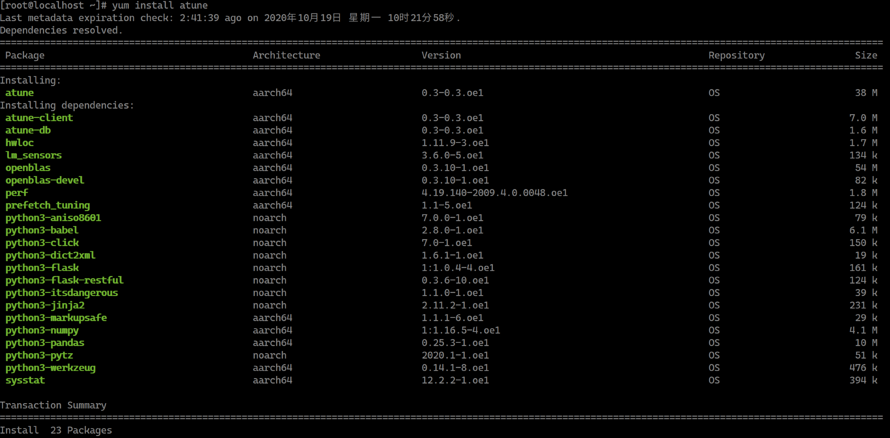

### Introduction to A-Tune

A-Tune is an AI-powered performance tuning software developed by openEuler. The vast number of configuration parameters of operating systems (OSs) and application software and the emerging software and service scenarios have posed a great challenge on how to achieve the optimal performance of OSs and application software. Though recent years have witnessed the rapid development of AI technology in various fields, there is no framework using AI technology to tune parameters of OSs and application software.  

Leveraging AI technology, A-Tune makes it easier to tune parameters of OSs and application software. Utilizing technologies such as system profiling, automatic awareness, and algorithm models, the too help developers set the optimal parameter configurations oriented to service requirements.

As a supplement to the official documents, this series of A-Tune blogs introduce the A-Tune functions in a detailed manner and present examples to rectify faults during usage.

### 1. Installation

- Hardware: Kunpeng 920
- Operating system: openEuler

A-Tune is a piece of performance tuning software dedicated to servers powered by Kunpeng 920 processors and the openEuler OS.  

It supports single-node deployment and distributed deployment. This blog takes the single-node deployment  (the client and server are )as an example to describe how to install the A-Tune.  

The A-Tune software package is integrated into the openEuler software repository. You can also install it through Yum.  

##### 1.1 Install atune client and atune db.

```
# yum install atune
```

The dependencies to be installed are listed as follows:  

- atune client  
- atune db  
- OS parameter collection dependencies: hwloc, perf, sysstat, prefetch_tuning, lm_sensors  
- Web micro-framework: python3_flask  
- Scientific computing packages: python3_numpy, python3_pandas  

  

##### 1.2 Install atune-engine.  

```
# yum install atune-engine
```

Most of the atune-engine dependency packages are  scientific computing libraries and algorithm libraries.  

  

##### 1.3 Check whether the installation is successful.  

  

### 2. Configure files.  

The A-Tune configuration files, among which `atuned.cnf` and `engine.cnf` are critical, are stored in `/etc/atuned/`.  

  

 

##### 2.1 Check `atuned.cnf`.  

```
cat /etc/atuned/atuned.cnf
```


##### 2.2 Modify the `network` argument.  

You can run the `ifconfig` command to query the NIC name.  

  

Set the value of **network** in `atuned.cnf` to the queried NIC name.  

```
# the network to be analysis
network = enp125s0f0
```

##### 2.3 Check `engine.cnf`.  

```
cat /etc/atuned/atuned.cnf
```

  

### 3. Deploy and start the A-Tune.  

##### 3.1 Run `systemctl` to start the A-Tune service.  

```
# systemctl start atuned
# systemctl status atuned
```

  

The log in yellow is a warning. This is because workload type detection is not performed when the A-Tune service is started. Therefore, no profile is activated. You can run the `atune-adm list` command to view that the status of all profiles is **false**.  

##### 3.2 Check the supported workload types.  

```
# atune-adm list
```

  

##### 3.3 Analyze the system performance and automatically activate the corresponding profile.  

```
# atune-adm analysis
```

  

  

A-Tune uses tools (such as perf and sysstat) to collect OS parameters during the analysis, and inputs those parameters to the trained model. Then A-Tune identifies that the workload type of the system is the **default** type, and sets the profile corresponding to the default workload type to the system.  

### 4. Summary

This blog introduces how to install, deploy, and start the A-Tune step by step, helping you get started with the tool. In the next blog, I'll introduce other functions of the A-Tune. Please stay tuned.
