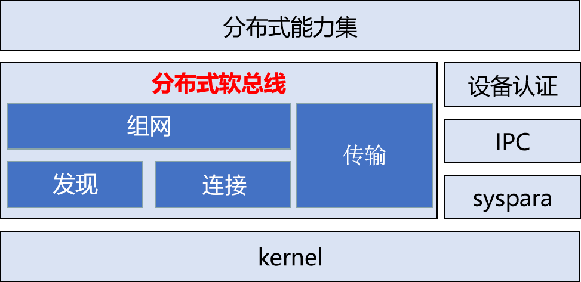

## 一 特性介绍

### **1.1 背景**

openEuler 秉承着打造“数字化基础设施操作系统”的愿景，为促进与 OpenHarmony 生态的合作与互通，实现端边领域的互通和协同，首次在嵌入式领域引入分布式软总线技术。

分布式软总线是 OpenHarmony 社区开源的分布式设备通信基座，为设备之间的互通互联提供统一的分布式协同能力，实现设备无感发现和高效传输。

OpenHarmony 主要面向强交互等需求的智能终端、物联网终端和工业终端。openEuler 主要面向有高可靠、高性能等需求的服务器、边缘计算、云和嵌入式设备，二者各有侧重。通过以分布式软总线为代表的技术进行生态互通，以期实现“1+1>2”的效果，支撑社区用户开拓更广阔的行业空间。

### **1.2 架构**

软总线的主要架构如下：



软总线主体功能分为发现、组网、连接和传输四个基本模块，实现：

- **即插即用**：快速便捷发现周边设备。
- **自由流转**：各设备间自组网，任意建立业务连接，实现自由通信。
- **高效传输**：通过 WIFI、蓝牙设备下软硬件协同最大化发挥硬件传输性能。

软总线南向支持标准以太网通信，同时后续可持续拓展 WIFI、蓝牙等多种通信方式。并为北向的分布式应用提供统一的 API 接口，屏蔽底层通信机制。

软总线依赖于设备认证、IPC、日志和系统参数（SN 号）等周边模块，嵌入式系统中将这些依赖模块进行了样板性质的替换，以实现软总线基本功能。实际的周边模块功能实现，还需要用户根据实际业务场景进行丰富和替换，以拓展软总线能力。

## 二、应用指南

### **2.1 部署示意**

软总线支持局域网内多设备部署，设备间通过以太网通信。单设备上分为 server 和 client，二者通过 IPC 模块进行交互。


> **注意**：
>
> 当前 IPC 模块和 SN 号等系统参数，嵌入式版本提供的仅为参考模板，还无法支持多节点和多 client 部署。用户可根据实际业务场景进行 IPC 模块和 SN 号系统参数进行功能丰富，以拓展软总线部署能力。

### **2.2 服务端启动**

服务端主程序为`softbus_server_main`，执行该主程序既可拉起软总线服务端。

```bash
openeuler ~ # softbus_server_main >log.file &
```

当服务端被拉起时，会主动通过名为 ethX 的网络设备进行 coap 广播，若探测到对端设备存在则会启动自组网。

### **2.3 客户端 API**

头文件在 sdk 和 initrd 中均存放在`/usr/include/dsoftbus/`下，其中：

1. discovery_service.h：发现模块头文件，支持应用主动探测和发布的 API 如下：

   | API              | 功能                  |
   | ---------------- | --------------------- |
   | PublishService   | 发布特定服务能力      |
   | UnPublishService | 取消发布特定服务能力  |
   | StartDiscovery   | 订阅/探测特定服务能力 |
   | StopDiscovery    | 取消订阅特性服务能力  |

   其中服务能力通过`g\_capabilityMap`数组定义，用户若新增能力需要自定义修改该数组，并重新编译软总线服务端和客户端程序来生效。

2. softbus_bus_center.h：组网模块头文件，支持获取组网内设备信息 API 如下：

   | API                  | 功能                       |
   | -------------------- | -------------------------- |
   | GetAllNodeDeviceInfo | 获取当前组网内所有节点信息 |

3. session.h：连接/传输模块头文件，支持创建 session 和数据传输 API 如下：

   | API                 | 功能                                                                 |
   | ------------------- | -------------------------------------------------------------------- |
   | CreateSessionServer | 创建 session 服务端                                                  |
   | RemoveSessionServer | 移除 session 服务端                                                  |
   | OpenSession         | 创建到对端的传输连接（同时依赖于本端和对端提前创建的 SessionServer） |
   | CloseSession        | 断开传输连接                                                         |
   | SendBytes           | 根据建好的连接 ID，进行数据传输。                                    |

各 API 参数详见头文件描述。

## 三、应用示例

使用 QEMU 部署分布式软总线，编写客户端程序，使其能够列出所有发现的设备信息。

步骤一、编写客户端程序

    编写客户端程序依托于Embedded版本发布的SDK，按如下步骤进行SDK环境使用准备。

    1. 安装SDK

        执行SDK自解压安装脚本

        ```bash
        sh openeuler-glibc-x86_64-openeuler-image-aarch64-qemu-aarch64-toolchain-22.03.sh
        ```

        根据提示输入工具链的安装路径，默认路径是`/opt/openeuler/<openeuler version>/`；若不设置，则按默认路径安装；也可以配置相对路径或绝对路径。

        举例如下：

        ```bash
        sh ./openeuler-glibc-x86_64-openeuler-image-armv7a-qemu-arm-toolchain-22.03.sh``
        openEuler embedded(openEuler Embedded Reference Distro) SDK installer version 22.03
        ================================================================
        Enter target directory for SDK (default: /opt/openeuler/22.03): sdk
        You are about to install the SDK to "/usr1/openeuler/sdk". Proceed [Y/n]? y
        Extracting SDK...............................................done
        Setting it up...SDK has been successfully set up and is ready to be used.
        Each time you wish to use the SDK in a new shell session, you need to source the environment setup script e.g.
        . /usr1/openeuler/sdk/environment-setup-armv7a-openeuler-linux-gnueabi
        ```

    2. 设置SDK环境变量

        前一步执行结束最后已打印source命令，运行即可。

        ```bash
        . /usr1/openeuler/myfiles/sdk/environment-setup-armv7a-openeuler-linux-gnueabi
        ```

    3. 查看是否安装成功

        运行如下命令，查看是否安装成功、环境设置成功。

         ```bash
        arm-openeuler-linux-gnueabi-gcc -v
         ```

    接下来编写客户端程序。

    创建一个`main.c`文件，源码如下：

    ```c
    #include "dsoftbus/softbus_bus_center.h"
    #include <stdio.h>
    #include <stdlib.h>
    int main(void)
    {
        int32_t infoNum = 10;
        NodeBasicInfo **testInfo = malloc(sizeof(NodeBasicInfo *) * infoNum);
        int ret = GetAllNodeDeviceInfo("testClient", testInfo, &infoNum);
        if (ret != 0) {
            printf("Get node device info fail.\n");
            return 0;
        }
        printf("Get node num: %d\n", infoNum);
        for (int i = 0; i < infoNum; i++) {
            printf("\t networkId: %s, deviceName: %s, deviceTypeId: %d\n",
            testInfo[i]->networkId,
            testInfo[i]->deviceName,
            testInfo[i]->deviceTypeId);
        }
        for (int i = 0; i < infoNum; i++) {
            FreeNodeInfo(testInfo[i]);
        }
        free(testInfo);
        testInfo = NULL;

        return 0;
    }
    ```

    创建一个`CMakeLists.txt`文件，源码如下：

    ```bash
    project(dsoftbus_hello C)
    add_executable(dsoftbus_hello main.c)
    target_link_libraries(dsoftbus_hello dsoftbus_bus_center_service_sdk.z)
    ```

    编译客户端

    ```bash
    mkdir build
    cd build
    cmake ..
    make
    ```

    编译完成后会得到`dsoftbus_hello`。

步骤二、构建 QEMU 组网环境

    在host中创建网桥br0

    ```bash
    brctl addbr br0
    ```

    启动qemu1

    ```bash
    qemu-system-aarch64 -M virt-4.0 -m 1G -cpu cortex-a57 -nographic -kernel zImage -initrd <openeuler-image-qemu-xxx.cpio.gz> -device virtio-net-device,netdev=tap0,mac=52:54:00:12:34:56 -netdev bridge,id=tap0
    ```

    > **注意**：
    >
    > 首次运行如果出现如下错误提示：
    >
    > ```bash
    > failed to parse default acl file `/usr/local/libexec/../etc/qemu/bridge.conf'
    > qemu-system-aarch64: bridge helper failed
    > ```
    >
    > 则需要向指示的文件添加“allow br0”
    >
    > ```bash
    > echo "allow br0" > /usr/local/libexec/../etc/qemu/bridge.conf
    >```

    启动qemu2

    ```bash
    qemu-system-aarch64 -M virt-4.0 -m 1G -cpu cortex-a57 -nographic -kernel zImage -initrd openeuler-image-qemu-aarch64-20220331025547.rootfs.cpio.gz  -device virtio-net-device,netdev=tap1,mac=52:54:00:12:34:78 -netdev bridge,id=tap1
    ```

    > **注意**：
    >
    > qemu1与qemu2的mac地址需要配置为不同的值。

    配置IP

    配置host的网桥地址

    ```bash
    ifconfig br0 192.168.10.1 up
    ```

    配置qemu1的网络地址

    ```bash
    ifconfig eth0 192.168.10.2
    ```

    配置qemu2的网络地址

    ```bash
    ifconfig eth0 192.168.10.3
    ```

    分别在host、qemu1、qemu2使用ping进行测试，确保qemu1可以ping通qemu2。

步骤三、启动分布式软总线

    在qemu1和qemu2中启动分布式软总线的服务端

    ```bash
    softbus_server_main >log.file &
    ```

    将编译好的客户端分发到qemu1和qemu2的根目录中

    ```bash
    scp dsoftbus_hello root@192.168.10.2:/
    scp dsoftbus_hello root@192.168.10.3:/
    ```

    分别在qemu1和qemu2的根目录下运行`dsoftbus_hello`，将得到如下输出：

    qemu1

    ```bash
    [LNN]NodeStateCbCount is 10
    [LNN]BusCenterClientInit init OK!
    [DISC]Init success
    [TRAN]init tcp direct channel success.
    [TRAN]init succ
    [COMM]softbus server register service success!

    [COMM]softbus sdk frame init success.
    Get node num: 1
            networkId: 714373d691265f9a736442c01459ba39236642c743a71750bb63eb73cde24f5f, deviceName: UNKNOWN, deviceTypeId: 0

    ```

    qemu2

    ```bash
    [LNN]NodeStateCbCount is 10
    [LNN]BusCenterClientInit init OK!
    [DISC]Init success
    [TRAN]init tcp direct channel success.
    [TRAN]init succ
    [COMM]softbus server register service success!

    [COMM]softbus sdk frame init success.
    Get node num: 1
            networkId: eaf591f64bab3c20304ed3d3ff4fe1d878a0fd60bf8c85c96e8a8430d81e4076,deviceName: UNKNOWN, deviceTypeId: 0
    ```

    qemu1和qemu2分别输出了发现的对方设备的基础信息。

## 四、编译指导

编译依托于 Embedded 版本发布的容器镜像，请参考容器构建指导进行容器环境准备。

容器构建指导链接：<https://docs.openeuler.org/zh/docs/22.03_LTS/docs/Embedded/容器构建指导.html>

1. 下载脚本所在仓库（例如下载到`src/yocto-meta-openeuler`目录下）

   ```bash
   git clone https://gitee.com/openeuler/yocto-meta-openeuler.git -b openEuler-22.03-LTS -v src/yocto-meta-openeuler
   ```

2. 执行下载脚本

   下载最新软总线代码:

   ```bash
   sh src/yocto-meta-openeuler/scripts/download_code.sh dsoftbus
   ```

   代码默认下载到与`yocto-meta-openeuler`同级别的路径，如需修改软总线或者其依赖的模块代码可到对应路径下查找`dsoftbus/_standard`和`yocto-embedded-tools`仓库进行对应修改。

3. 编译编译脚本

   编译最新软总线代码:

   ```bash
   sh src/yocto-meta-openeuler/scripts/compile.sh dsoftbus
   ```

   编译工作目录名为`dsoftbus/_build`，编译生成件目录名为`dsoftbus/_output`，二者均默认与`yocto-meta-openeuler`在同级别路径。

## 五、限制约束

1. 仅支持局域网下的 coap 发现。WIFI/BLE 等功能在后续版本中持续支持。

2. 目前提供的 IPC、SN 号等软总线的依赖模块均为样例，仅支持双设备节点部署，client-server 一对一部署的能力。期待后续与社区伙伴，根据实际场景共同对这些依赖模块进行实例化。

### 关注我们

Embedded 已经在 openEuler 社区开源。将开展一系列主题分享，如果您对 Embedded 的构建，应用感兴趣，欢迎围观和加入。

项目地址：<https://gitee.com/openeuler/yocto-meta-openeuler>

欢迎大家多多 star、fork，多多参与社区开发，多多贡献。

### 进入交流群

如果您对嵌入式应用感兴趣，欢迎加入 openEuler Embedded&Yocto SIG 技术交流群，讨论 Embedded 和 Yocto 等相关技术。请扫描下方二维码加入群聊。


