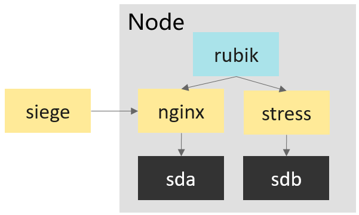
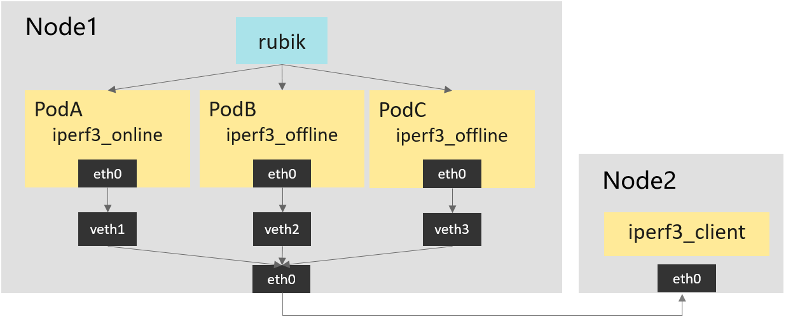
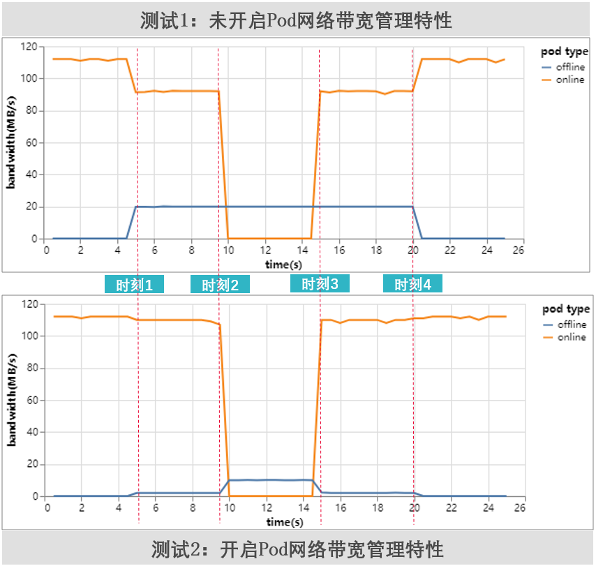

前文\[1\]介绍了资源利用率提升这个课题的产生背景、形成原因、解决思路，以及在 openEuler 上所构建的资源利用率整体解决方案和技术演进思路。

本篇我们针对容器在离线场景下的典型应用类型（ CPU 敏感型、内存敏感型、网络 IO 敏感型 ），并在搭载了 openEuler 混合部署 QoS 方案的 x86 环境上展开了专项的应用场景测试。

## 案例 1：CPU 调度敏感型应用

针对 CPU 调度敏感型应用场景，我们选择了 CloudSuite\[2\]的两个测试套件作为混合部署的在离线业务进行混部：

- 在线业务选用 **Web Serving** 测试套\[3\]：模拟用户向社交网络服务器发送不同请求的场景，服务端基于社交网络引擎（Elgg）实现，客户端根据 Faban 工作负载生成器实现。业务性能度量指标为平均每秒操作数、响应时延等。
- 离线业务选用 **In-Memory Analytics** 测试套\[4\]：通过 Apache Spark 在内存中运行协作过滤算法训练用户电影评级模型，生成测试用户推荐电影列表。业务性能度量指标为计算电影推荐的时间（以秒为单位）。

从应用特征上而言，Web Serving 为 CPU 敏感型应用，且具有实时性，对响应延迟敏感度高，符合在线业务的特征，In-Memory Analytics 为 CPU 密集型业务，消耗大量的计算资源，符合离线业务的特征，将此二者混合部署能够有效利用 Web Serving 空闲时的 CPU 资源，实现资源利用率的提升，但如果只是简单地混合部署，CPU 密集的离线业务必然会对在线业务产生极大的干扰，采用混部 QoS 特性实现在线业务的 CPU 抢占，能够有效保障在线业务的性能。

测试设计上，始终关注在线业务的性能数据，然后分别测试三组数据：

1.  在线业务单独运行时，在线业务 Web Serving 的性能数据
2.  在离线业务混部、无混部 QoS 特性干预下，在线业务 Web Serving 的性能数据
3.  在离线业务混部、有混部 QoS 特性干预下，在线业务 Web Serving 的性能数据

通过将三组的测试数据放到一起，获得如下两个曲线图：

从上面的曲线数据图可见，在 2 小时的测试周期里， 没有开启混部 QoS 特性的测试 2，在线业务受到了明显的干扰，Web Serving 对 BrowsetoElgg 以及 Register 请求的平均响应时间均延长到了 3 倍左右，可见在线业务在受到离线业务干扰后性能下降了 3 倍；而开启了混部 QoS 特性的测试 3，在线业务的性能基本能够与仅运行在线业务的测试 1 持平。

以上测试结果表明，当业务之间发生 CPU 争抢时，混部 QoS 方案加持下的在线业务优先得到了关键的 CPU 资源。这其中，openEuler 的 CPU 绝对抢占技术发挥了巨大的作用。

## 案例 2：CPU 限流敏感型应用

通常，用户在 Kubernetes 集群中部署业务时需要限制容器可使用 CPU 数量。然而，固定的资源难以满足 CPU 限流敏感型业务（即对短时突发流量敏感的应用）的运行需求。例如：

1.  单个应用实例 CPU 规格较小 ，使用率较低，有规律突发增长
2.  应用长期平稳运行，运行过程中突发 CPU 使用飙升
3.  应用总体使用率较低， 但启动时使用率较高

这几类场景，相比于案例 1 中所提到的 CPU 调度敏感型，我们将这类应用分类为 CPU 限流敏感型。

为方便测试，我们仿照上述三类短时突发流量业务，模拟了一个长期平稳运行但运行过程中 CPU 会规律性进行突发增长的测试业务，该业务：

- 通过 Stress 工具来担任在线业务，模拟业务流量短时冲高的场景。在平稳运行时仅占用 1 个 CPU ，每 30 秒规律突发时长为 1ms 的高峰流量，在高峰时期会占用 3 个 CPU
- 将该在线业务部署于 Kubernetes 集群，并限制该业务最大可用 CPU 数为 2 个 CPU

在测试时，首先开启 openEuler 的混部 QoS 特性，运行以上测试用例，在测试过程中通过观察压制（throttled）次数来观察容器在应对突发流量时的运行情况。

下图是测试过程中的应用运行情况。上半部展示容器压制次数，下半部展示容器运行过程的 CPU 变化情况。其中，在时刻 1\~4 ，业务容器会产生突发流量，此时容器的 CPU 使用会从 1 核增加至 3 核。可以看到，随着 openEuler 的混部 QoS 特性主动调整受压制容器的 CPU 配额值，容器受压制情况逐渐缓解直至容器不再受到压制。

由上可见，针对 CPU 限流敏感型应用，openEuler 的混部 QoS 同样可以对它进行有效的控制。在此过程中，使用了我们所设计的 quotaTurbo 特性。该特性的整体思路是在业务运行过程中，持续监控容器的压制（ throttled ）状态，并依据当前 CPU 负载对容器所使用的 CPU 时间片进行分级调整。在保障整机负载水位安全稳定及不影响其他业务的前提下，按需动态调整业务容器 CPU 限额，实现业务 CPU 动态调整、降低了业务的节流率，从而提高业务的整体运行性能。

## 案例 3：内存敏感型应用

前面介绍了两个 CPU 敏感型应用的例子，接下来我们来看下内存敏感型应用在容器在离线混部时会碰到的问题：假设容器在离线混部时，参与混部的离线业务是内存消耗型，其占用了过多的内存，导致在线业务在需要的时候申请不到内存，从而在线业务的 QoS 下降。

在这种场景下，从技术层面我们需要压制离线应用的内存使用量并及时释放离线应用所使用的内存。所以，我们在 openEuler 的混部 QoS 方案上开发了基于 cgroup 级的内存管理快压制慢恢复方案（FSSR）。

下面，我们通过一个测试用例来验证 FSSR 方案的效果。我们通过以下这个测试模型进行用户模拟测试 ：

在本测试里，图上各黄色标识的进程分别担任以下角色：

- 在线业务（nginx）：因其对时延敏感，担任在线业务。测试时下载用户指定的文件并连续进行传输
- 离线业务（stress）：对时延不敏感，但会大量使用内存，担任离线业务。测试时让其同时进行内存和磁盘写、占用一定数量的匿名内存和 page cache
- 客户端（siege）：由其模拟用户行为，对在线业务 nginx 发送 HTTP 请求

在测试时，重点观测点是在线业务的 QoS（即业务的下载耗时），并设计三个测试用例：

1.  在离线业务混部，不开启混部 QoS 的 FSSR 特性
2.  在离线业务混部，开启混部 QoS 的 FSSR 特性
3.  仅运行在线业务

在测试完成后，我们获得如下曲线图：

能够看到：

- 如左半图所示，随着测试时连续下载次数的增加，在线业务的 QoS（下载耗时）开始下降。相比于没有开启 FSSR 策略的测试 1，在开启了 FSSR 策略的测试 2 里，在线业务的 QoS 得到了显著的提升。这意味着，当请求下载次数增加，开启 FSSR 策略时，在线业务的内存上限会随着使用量增大而增大，page cache 中会缓存大量已经读取的文件，从而减少了磁盘读写的次数，保障了在线业务的 QoS
- 如右半图所示，当开启 FSSR 策略时（测试 2 ），在线业务的 QoS 能够与仅运行在线业务（测试 3 ）的内存使用量相近。这意味着在线应用会尽可能的利用内存的资源，从而在和离线应用竞争时能够处于竞争优势地位

以上测试表明，通过使用动态调整在线业务和离线业务内存分配的 FSSR 策略，能够优先保障在线业务的内存使用，提升在线业务在在离线混部时的 QoS。

## 案例 4：网络 IO 敏感型应用

最后，我们一起来分析下网络 IO 敏感型应用的场景。当在离线业务混部时，如离线业务某段时间网络 IO 需求增高，在离线业务产生网络资源的争抢。此时，在线业务如果无法及时获得关键的网络资源，就会导致 QoS 的下降。针对这种场景，我们 openEuler 的混部 QoS 方案开发了容器 POD 带宽管理特性。

同样的，我们设计了一个测试用例来验证该特性的效果。为了便于观察网络带宽的变化，本次测试的在线业务和离线业务均采用了 iperf3\[5\] 来模拟业务进程。网络拓扑模型如下 ：

测试步骤如下：

1.  在 Node1 上，

    1.  通过 rubik 开启 Pod 带宽管理特性，设置 node 上的离线业务的总体带宽和在线业务的限流水位
    2.  给在离线业务容器所在的 cgroup 设置不同的 qos_level，进行在离线业务的标识

2.  在 Node2 上，启动 iperf3 的客户端工具给在离线业务发送请求，让在离线业务按需发起网络流量。同时设置 4 个时间点：

    1.  在测试刚开始时，在线业务尽可能的占据网络带宽，而离线业务未启动
    2.  时刻 1 ，在第 5 秒时，离线业务上线。此时在离线业务开始竞争网络资源
    3.  时刻 2 ，在第 10 秒时，在线业务下线。此时仅留离线业务继续运行
    4.  时刻 3 ，在第 15 秒时，在线业务上线。此时在离线业务再次竞争网络资源
    5.  时刻 4 ，在第 20 秒时，离线业务下线。此时仅留在线业务继续运行

3.  在测试过程中，持续观测 Node1 上业务容器的网络带宽使用情况。

通过采集未开启/开启 Pod 网络带宽管理特性两轮测试的测试数据，获得曲线图如下。可见：

- 时刻 1 时，离线业务开始竞争网络资源。在测试 1 ，在线业务的带宽受到了影响；而测试 2 ，在线业务的带宽几乎不受影响；
- 时刻 2 时，在线业务停止处理请求。在测试 2 里，之前一直被压制的离线业务，终于获得更多的网络带宽；
- 时刻 3 时，在线业务恢复处理请求。测试 2 的在线业务马上获得了尽可能多的网络带宽，同时离线业务的带宽受到了压制。相比之下，测试 1 的在线业务始终没法获得充足的网络带宽；
- 时刻 4 时，离线业务停止竞争网络资源。此时测试 1 的在线业务才可以获得足够的网络带宽

由上测试可见，通过 openEuler 混部 QoS 方案的 Pod 网络带宽管理特性，当在离线业务竞争网络资源的时候，在线业务能够在百毫秒内实现带宽资源的抢占，快速获得急需的网络带宽资源，从而保障了在线业务的 QoS。

## 总结

通过上面的四个案例，我们为大家展示了 openEuler 的资源利用率提升方案可以为在线业务带来的一些收益：即在提升节点资源利用率的时候，通过多维度资源优先级隔离和自动干扰控制保证关键在线业务的服务质量。

接下来，我们会在后续的系列文章中逐一为大家带来关键特性的技术剖析。

## 参考

1.  openEuler 资源利用率提升之道 01 ： 概论：[https://mp.weixin.qq.com/s/x9sdogEslRJJ5mDbs5bxgQ](https://mp.weixin.qq.com/s/x9sdogEslRJJ5mDbs5bxgQ)

1.  CloudSuite | A Benchmark Suite for Cloud Services：[https://www.cloudsuite.ch/](https://www.cloudsuite.ch/)
1.  Web Serving：[https://github.com/parsa-epfl/cloudsuite/blob/main/docs/benchmarks/web-serving.md](https://github.com/parsa-epfl/cloudsuite/blob/main/docs/benchmarks/web-serving.md)
1.  In-Memory Analytics：[https://github.com/parsa-epfl/cloudsuite/blob/main/docs/benchmarks/in-memory-analytics.md](https://github.com/parsa-epfl/cloudsuite/blob/main/docs/benchmarks/in-memory-analytics.md)
1.  iPerf - The TCP, UDP and SCTP network bandwidth measuremen t tool：[https://iperf.fr/](https://iperf.fr/)

## 系列文章回顾

openEuler 资源利用率提升之道 01 概论：[https://mp.weixin.qq.com/s/x9sdogEslRJJ5mDbs5bxgQ](https://mp.weixin.qq.com/s/x9sdogEslRJJ5mDbs5bxgQ)

## 加入我们

文中所述资源利用率提升技术，由 Cloud Native SIG、High Performance Network SIG，Kernel SIG, OpenStack SIG 和 Virt SIG 共同参与，其源码将在 openEuler 社区逐步开源。如果您对相关技术感兴趣，欢迎您的围观和加入。您可以添加小助手微信，加入对应 SIG 微信群。

