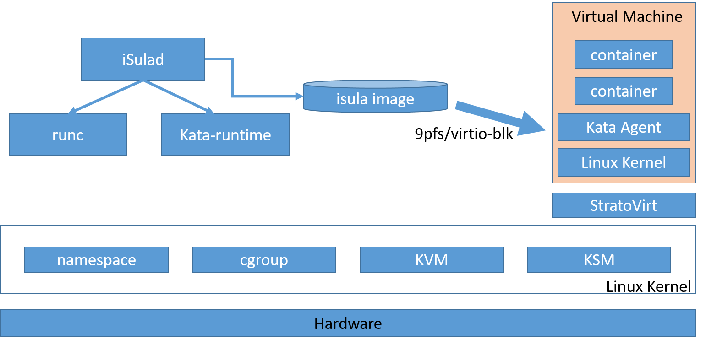

## 背景介绍

StratoVirt 作为虚拟化平台，实现了一套架构统一支持虚拟机，容器，Serverless三种场景。我们的 StratoVirt 同时具备了虚拟化的安全特性和容器的轻量级开销。是否想要实际上手操作一番呢？本文就来介绍如何使用 StratoVirt 运行一台虚拟机。另外，在容器场景下，小编也会带来对接 iSulad 容器引擎，运行一台安全容器的操作指导。

## 软硬件要求

### 最低硬件要求

- 处理器架构：仅支持 AArch64 和 x86_64 处理器架构。AArch64 需要 ARMv8 及更高版本且支持虚拟化扩展；x86_64支持 VT-x。
- 2核 CPU
- 4GiB 内存
- 16GiB 可用磁盘空间

### 软件要求

操作系统：openEuler 20.09 及更高版本 

## 安装 StratoVirt

这里提供了两种方式安装 StratoVirt。如果你只想要使用 StratoVirt 运行一台虚拟机，小编推荐组件安装的方式。你只需要按照软硬件要求，安装 [openEuler 20.09](https://www.openeuler.org/zh/docs/20.09/docs/Installation/installation.html) 及更高版本，并且配置好 openEuler yum 源。那么就可以直接使用 yum 命令安装啦。

如果你有很强的好奇心，希望深入了解我们的 StratoVirt。那太好了，编译安装的方式更适合你。作为开源项目，我们的 StratoVirt 源码放在[码云](https://gitee.com/openeuler/stratovirt)平台上。 你可以下载我们的源码，了解它的架构，甚至对其做一些代码修改。

### 组件安装

步骤1：用 yum 命令安装

```
[root@openeuler ~]# yum install -y stratovirt
```

说明：安装前，确保已经配置好 openEuler yum 源。

### 编译安装

步骤1：环境准备，确保 Rust 语言环境和 Cargo 软件已经安装成功。

请参考链接的指导进行安装：<https://www.rust-lang.org/tools/install> 

步骤2：编译软件

```
[root@openeuler ~]# git clone https://gitee.com/openeuler/stratovirt.git
[root@openeuler ~]# cd stratovirt
[root@openeuler ~]# cargo build --release
```

生成的二进制文件在 target/release/stratovirt 路径下。

## StratoVirt 运行虚拟机

步骤1：准备设备和工具

```
[root@openeuler ~]# modprobe vhost_vsock
[root@openeuler ~]# yum install nmap
```

步骤2：制作PE格式的 kernel 镜像

```
[root@openeuler ~]# yum install git; yum install gcc; yum install make; yum install bison; yum install flex
[root@openeuler ~]# cd /home; git clone https://gitee.com/openeuler/kernel
[root@openeuler ~]# cd kernel; git checkout kernel-4.19
[root@openeuler ~]# cd /home; git clone https://gitee.com/openeuler/stratovirt.git
[root@openeuler ~]# cp stratovirt/docs/kernel_config/config_openeuler_4.19_aarch64 kernel/.config
[root@openeuler ~]# cd kernel; make –j vmlinux; objcopy -O binary vmlinux vmlinux.bin
```

生成的 /home/kernel/vmlinux.bin 就是制作好的 kernel 镜像。

说明：如果使用 x86_64 处理器架构，需要拷贝 stratovirt/docs/kernel_config/config_openeuler_4.19_x86_64 到 kernel 路径下并重命名为.config。

步骤3：制作EXT4格式的 rootfs 镜像

```
[root@openeuler ~]# cd /home
[root@openeuler ~]# dd if=/dev/zero of=./rootfs bs=1G count=5
[root@openeuler ~]# mkfs.ext4 ./rootfs
[root@openeuler ~]# mkdir /mnt/rootfs; mount /home/rootfs /mnt/rootfs
[root@openeuler ~]# cd /mnt/rootfs
[root@openeuler ~]# wget http://dl-cdn.alpinelinux.org/alpine/latest-stable/releases/aarch64/alpine-minirootfs-3.12.0-aarch64.tar.gz
[root@openeuler ~]# tar -zxvf alpine-minirootfs-3.12.0-aarch64.tar.gz; rm alpine-minirootfs-3.12.0-aarch64.tar.gz
[root@openeuler ~]# rm sbin/init; touch sbin/init && cat > sbin/init <<EOF
#! /bin/sh
mount -t devtmpfs dev /dev
mount -t proc proc /proc
mount -t sysfs sysfs /sys
ip link set up dev lo
exec /sbin/getty -n -l /bin/sh 115200 /dev/ttyS0
poweroff -f
EOF
[root@openeuler ~]# chmod +x sbin/init
[root@openeuler ~]# cd /home; umount /mnt/rootfs
```

/home/rootfs 就是制作好的 rootfs 镜像。

说明：在获取对应处理器架构的最新 alpine-mini rootfs 阶段，如果是x86_64处理器架构，参考命令如下：

```
[root@openeuler ~]# wget http://dl-cdn.alpinelinux.org/alpine/latest-stable/releases/x86_64/alpine-minirootfs-3.12.0-x86_64.tar.gz
[root@openeuler ~]# tar -zxvf alpine-minirootfs-3.12.0-x86_64.tar.gz
[root@openeuler ~]# rm alpine-minirootfs-3.12.0-x86_64.tar.gz
```

步骤4：使用 stratovirt 命令运行虚拟机

```
[root@openeuler ~]# rm /tmp/stratovirt.socket
[root@openeuler ~]# stratovirt -kernel /home/kernel/vmlinux.bin -append console=ttyS0 root=/dev/vda rw reboot=k panic=1 -drive file=/home/rootfs,id=rootfs -api-channel unix:/tmp/stratovirt.socket -serial stdio
```

运行后，在终端会打印内核启动的串口日志，表明虚拟机已经成功启动。以下是虚拟机启动日志的部分内容：

```
[    0.000000] Booting Linux on physical CPU 0x0000000000 [0x481fd010]
[    0.000000] Linux version 4.19.152+ (root@localhost.localdomain) (gcc version (GCC)) #1 SMP Fri Oct 23 14:56:45 CST 2020
[    0.000000] Machine model: linux,dummy-virt
[    0.000000] earlycon: uart0 at MMIO 0x0000000040009000 (options '')
[    0.000000] bootconsole [uart0] enabled
...
...
[    0.113561] Freeing unused kernel memory: 576K
[    0.113957] Run /sbin/init as init process
/ #
```

说明：如果是编译安装，需使用对应路径下二级制文件 stratovirt 运行虚拟机。

## StratoVirt对接iSulad并运行安全容器

iSulad是一种容器引擎，具有轻、灵、巧、快的特点。你可以点击[这里](https://www.openeuler.org/zh/docs/20.09/docs/Container/iSula%E5%AE%B9%E5%99%A8%E5%BC%95%E6%93%8E.html)了解详情。那什么是安全容器呢？简单来说，安全容器使用虚拟化层进行容器间的隔离，使同一主机上的不同容器间具有更强的隔离性。

安全容器的架构如下图所示：



上图展示的容器都运行在单独的虚拟机中，StratoVirt 虚拟化技术提供了虚拟化层的安全隔离。我们将使用 iSulad容器引擎，kata containers 容器运行时和 StratoVirt 虚拟化平台，运行一个安全容器。如果你希望在其他openEuler 版本或 linux 平台上运行安全容器，你可以在 bilibili - openEuler - 如何安装并使用 StratoVirt 视频中找到相应的方法。

### 准备工作

步骤1：准备设备和工具

```
[root@openeuler ~]# modprobe vhost_vsock
[root@openeuler ~]# yum install nmap
```

步骤2：安装 iSulad 和 kata-containers

```
[root@openeuler ~]# yum install iSulad; yum install kata-containers
```

步骤3：添加 iSulad 的 runtime

```
[root@openeuler ~]# vi /etc/isulad/daemon.json     // 在runtimes节点中添加如下内容：
"kata-runtime": {
	"path": "/usr/bin/kata-runtime"
}
```

步骤4：配置 Storage

```
[root@openeuler ~]# dd if=/dev/zero of=/home/isula_images bs=1G count=10
[root@openeuler ~]# losetup /dev/loop1 /home/isula_images
[root@openeuler ~]# pvcreate /dev/loop1
[root@openeuler ~]# vgcreate isulaVG0 /dev/loop1
[root@openeuler ~]# lvcreate --wipesignatures y -n thinpool isulaVG0 -l 95%VG
[root@openeuler ~]# lvcreate --wipesignatures y -n thinpoolmeta isulaVG0 -l 1%VG
[root@openeuler ~]# lvconvert -y --zero n -c 512K --thinpool isulaVG0/thinpool --poolmetadata isulaVG0/thinpoolmeta
[root@openeuler ~]# vi /etc/lvm/profile/isulaVG0-thinpool.profile  // 添加如下内容：
activation {
	thin_pool_autoextend_threshold=80
	thin_pool_autoextend_percent=20
}
[root@openeuler ~]# vi /etc/isulad/daemon.json   // 更改storage-driver和storage-opts为如下内容：
"storage-driver": "devicemapper",
"storage-opts": [
	"dm.thinpooldev=/dev/mapper/isulaVG0-thinpool",
	"dm.fs=ext4",
	"dm.min_free_space=10%"
],
```

步骤5：重启 iSulad

```
[root@openeuler ~]# systemctl daemon-reload; systemctl restart isulad
```

使用 isula info 方式，显示 isula 配置信息。如果配置信息有如下显示，恭喜你，isula存储驱动已经配置成功了。

```
Storage Driver: devicemapper
```

### 配置 kata-containers

步骤1：制作 kata-containers 的 kernel 镜像

```
[root@openeuler ~]# cd /home
[root@openeuler ~]# git clone https://github.com/kata-containers/packaging.git
[root@openeuler ~]# cp packaging/kernel/configs/arm64_kata_kvm_4.19.x kernel/.config
[root@openeuler ~]# cd kernel; make –j vmlinux; objcopy -O binary vmlinux vmlinux.bin
[root@openeuler ~]# cp vmlinux.bin vmlinux_kata
```

步骤2：修改 kata 配置

```
[root@openeuler ~]# vi /usr/share/defaults/kata-containers/configuration.toml // 修改下面几项内容：
[hypervisor.stratovirt]
path = "/home/stratovirt.sh"
kernel = "/home/kernel/vmlinux_kata "
initrd = "/var/lib/kata/kata-containers-initrd.img"
block_device_driver = "virtio-mmio"
use_vsock = true
enable_netmon = false
internetworking_model="none"
sandbox_cgroup_with_emulator = false
```

### 运行安全容器

步骤1：创建运行脚本

```
[root@openeuler ~]# cat > /home/stratovirt.sh <<EOF	
#!/bin/bash
export STRATOVIRT_LOG_LEVEL=info  # set log level which includes trace, debug, info, warn and error.
/usr/bin/stratovirt $@
EOF
[root@openeuler ~]# chmod +x /home/stratovirt.sh
```

步骤2：运行

```
[root@openeuler ~]# isula run -tid --runtime=kata-runtime --net=none --name test busybox:latest sh
```

运行后，通过 isula ps 可以看到运行中的 test 容器，通过下面指令在容器内运行命令：

```
[root@openeuler ~]# isula exec –ti test sh
```
到这里，我们就运行了一个安全容器，你就可以像操作一个普通容器一样操作这个安全容器了。