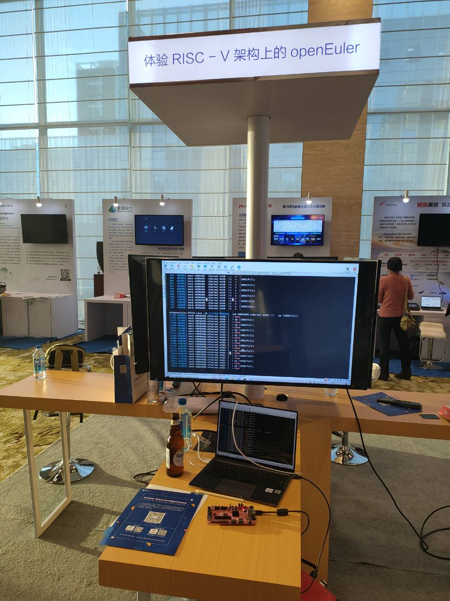

# 手把手教你搭建基于 RISC-V 的 openEuler 系统，部署 runc并运行容器

RISC-V 是一个基于精简指令集（RISC）原则的开源指令集架构（ISA）。openEuler 在 RISC-V 上进行了一些探索：

[^]: 以下相关信息来自于 https://gitee.com/openeuler/RISC-V 

- 2020年 6 月，openEuler 发布了第一版支持 RISC-V 的文件系统 rootfs 和 kernel 镜像。
- 2020年 8 月，在 OBS 构建系统开始构建 openEuler RISC-V 软件包。
- 2020年 9 月，在华为全联接（HC）2020 大会上发布了 openEuler RISC-V，国内首发 RISC-V 版 Linux。
- 2020年 10 月，中科院成功移植 openEuler RISC-V 到果壳（nutshell）。
- 2020年 11 月，在 openEuler 镜像仓发布第二版 rootfs 和 kernel 镜像，可以在 qemu 中启动镜像，体验 openEuler RISC-V 移植版。



**openEuler Summit 上展示的运行在果壳芯片上的 openEuler RISC-V **

在容器技术炙手可热的今天，各个技术公司都积极拥抱容器。如何使用 QEMU 模拟器启动 openEuler RISC-V 移植版，并在其中运行容器呢？本文将带你一探究竟。

### 环境要求

- 运行环境：Linux
- 所需文件：openEuler RISC-V 系统镜像，请参见 "获取 openEuler RISC-V 移植版系统镜像"
- 软件环境：QEMU >= 4.0.0  <=5.0.1，请参见 "获取 openEuler RISC-V 移植版系统镜像"

#### 获取 openEuler RISC-V 移植版系统镜像

在 openEuler 官网可以获得 openEuler RISC-V 移植版发布的最新版本的 openEuler RISC-V 镜像以及 repo 源，名称为 **openEuler Preview**
```
https://repo.openeuler.org/openEuler-preview/RISC-V/Image/
```
其中的两个文件是启动 openEuler RISC-V 移植版所必需的：
- **fw_payload_oe_docker.elf** 利用 openSBI 将 kernel-5.5 的 image 作为 payload 所制作的用于 QEMU 启动的 image，同时它也增加了 Docker 相关的启动配置。
- **openEuler-preview.riscv64.qcow2** openEuler RISC-V移植版的rootfs镜像。

#### 通过 QEMU 启动一个 openEuler RISC-V
首先你需要在你的 Host Linux 环境中有 qemu-system-riscv64 的二进制程序，如果你的 Linux 环境的 repo源中没有提供这个二进制，那么则需要手动从 QEMU 的源码构建出来，具体的构建方式如 QEMU 的官方指导所述：

[Build QEMU for Platforms/RISCV](https://wiki.qemu.org/Documentation/Platforms/RISCV)

可以参考以下命令：

```
git clone https://gitee.com/openeuler/qemu.git
cd qemu
./configure --target-list=riscv64-softmmu && make
cp riscv64-softmmu/qemu-system-riscv64 /bin
```
QEMU 的启动方式，这里以主机端口转发的方式实现网络功能
```
$ qemu-system-riscv64 \
  -nographic -machine virt \
  -smp 8 -m 2G \
  -kernel fw_payload_oe_docker.elf \
  -drive file=openEuler-preview.riscv64.qcow2,format=qcow2,id=hd0 \
  -object rng-random,filename=/dev/urandom,id=rng0 \
  -device virtio-rng-device,rng=rng0 \
  -device virtio-blk-device,drive=hd0 \
  -device virtio-net-device,netdev=usernet \
  -netdev user,id=usernet,hostfwd=tcp::12055-:22 \
  -append 'root=/dev/vda1 rw console=ttyS0 systemd.default_timeout_start_sec=600 selinux=0 highres=off mem=4096M earlycon'
```
当系统启动之后，可以通过 ssh 登录 Guest OS，并且在模拟器中应当是可以访问互联网的。系统默认的登录用户名/密码是：root/openEuler12#$
```shell
 ssh -p 12055 root@localhost
```


### 部署 runc 并运行容器

说明：接下来的操作均在所启动的 openEuler RISC-V 的模拟器运行的 Guest OS 中。

#### 安装 runc 软件包

openEuler RISC-V repo 源中包含了 runc 软件包，配置 repo 并安装 runc 的参考命令如下：

```shell
# yum-config-manager --add-repo https://repo.openeuler.org/openEuler-preview/RISC-V/everything/
# yum install docker-runc
```

#### 准备容器镜像

1. 准备工作目录

   在正式部署之前，先来准备一个工作目录，比如 mycontainer，本文后续的所有操作都在这个目录下执行。

   ```shell
   mkdir mycontainer
   cd mycontainer
   ```

2. 准备容器启动镜像

   使用自己制作的 rootfs 作为容器启动镜像。假设自制的文件系统中需要 gcc（根据用户自己实际情况确定安装的软件），则参考命令如下：

   ```shell
   mkdir rootfs
   yum install gcc --installroot=`pwd`/rootfs
   ```

#### 使用 runc 运行容器

有了 rootfs 之后，我们需要按照 OCI 标准，有一个配置文件`config.json` 说明如何运行容器，包括要运行的命令、权限、环境变量等内容，runc 提供了一个命令可以自动帮我们生成该配置文件：

```bash
[root@openEuler-RISCV-rare mycontainer]# runc spec
[root@openEuler-RISCV-rare mycontainer]# ls
config.json  rootfs
```

这样就构成了一个 [OCI runtime bundle](https://github.com/opencontainers/runtime-spec/blob/master/bundle.md) 的内容，这个 bundle 非常简单，就上面两个内容：config.json 文件和 rootfs 文件系统。`config.json` 里面的内容很长，这里就不贴出来了，我们暂时也不会对其进行修改，直接使用这个默认生成的文件。有了这些信息，runc 就能知道怎么运行容器了，我们先来看看简单的方法 `runc run`（这个命令需要 root 权限），它会创建并启动一个容器： 

```bash
[root@openEuler-RISCV-rare mycontainer]# runc run openEuler_container
sh-5.0# ls
bin  boot  dev	etc  home  lib	lib64  media  mnt  opt	proc  root  run  sbin  srv  sys  tmp  usr  var
sh-5.0# whoami
root
sh-5.0# pwd
/
sh-5.0# echo hello container
hello container
```

最后一个参数是容器的名字，需要在主机上保证唯一性。运行之后直接进入到了容器的 `sh` 交互界面，但是这个容器并没有配置网络方面的内容，只是有一个默认的 `lo` 接口，因此无法和外部通信，但其他功能都正常。

此时，另开一个终端，可以查看运行的容器信息：

```bash
[root@openEuler-RISCV-rare ~]# runc list
ID                    PID         STATUS      BUNDLE              CREATED                        OWNER
openEuler_container   17318       running     /home/mycontainer   2019-09-03T15:27:25.5978852Z   root

```

启动容器的第二种方式是使用specs生命周期操作，可以更好地创建和管理容器。但是这样会使容器在后台启动，所以需要对 `config.json` 进行修改。改动有两处，把 `terminal` 的值改成 `false`，修改 `args` 命令行参数为 `sleep 20`。`args `的命令只是一个样例，使用中可以根据实际需求进行修改： 

```json
"process": {
		"terminal": false,
		"consoleSize": {
			"height": 0,
			"width": 0
		},
		"user": {
			"uid": 0,
			"gid": 0
		},
		"args": [
			"sleep", "20"
		],
		···
}
```

接着用 runc 命令来控制容器的运行，实现各个容器状态的转换

1. 使用 `create` 创建容器。此时容器没有运行，只是准备好了所有运行环境，使用 `list` 查看，此时容器状态为 `created`。

   假设容器名为 openEuler，参考命令如下：

```bash
[root@openEuler-RISCV-rare mycontainer]# runc create openEuler
[root@openEuler-RISCV-rare mycontainer]# runc list
ID          PID         STATUS      BUNDLE              CREATED                        OWNER
openEuler   17402       created     /home/mycontainer   2019-09-03T15:37:46.6289281Z   root
```

2. 运行容器，会执行启动命令 `sleep 20`。使用 `list` 查看，此时容器状态为`running`。

```shell
[root@openEuler-RISCV-rare mycontainer]# runc start openEuler
[root@openEuler-RISCV-rare mycontainer]# runc list
ID          PID         STATUS      BUNDLE              CREATED                        OWNER
openEuler   17402       running     /home/mycontainer   2019-09-03T15:37:46.6289281Z   root
```
3. 容器运行 20 秒之后，容器关闭，状态为`stop`。

```shell
[root@openEuler-RISCV-rare mycontainer]# runc list
ID          PID         STATUS      BUNDLE              CREATED                        OWNER
openEuler   0           stopped     /home/mycontainer   2019-09-03T15:37:46.6289281Z   root
```

4. 删除容器，容器的信息就不在了。

```shell
[root@openEuler-RISCV-rare mycontainer]# runc delete openEuler
[root@openEuler-RISCV-rare mycontainer]# runc list
ID          PID         STATUS      BUNDLE      CREATED     OWNER
```

今天的介绍就到这里，更多关于 runc 使用的介绍可以用 `runc -h` 查看。后续 openEuler RISC-V 的 Docker 也会使能哦！
更多关于 openEuler RISC-V 的内容请关注

```
https://gitee.com/openeuler/RISC-V
```
