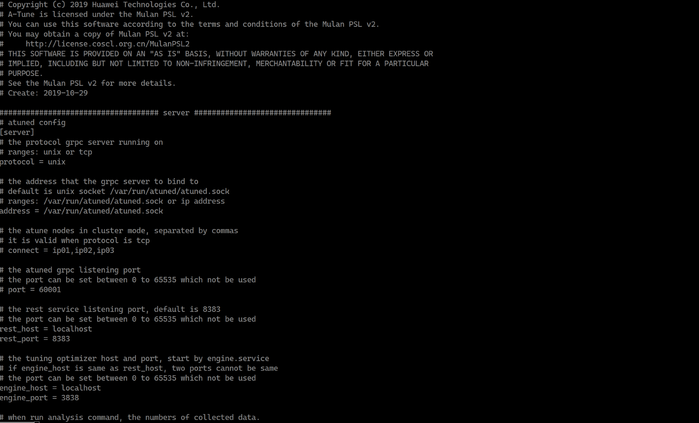
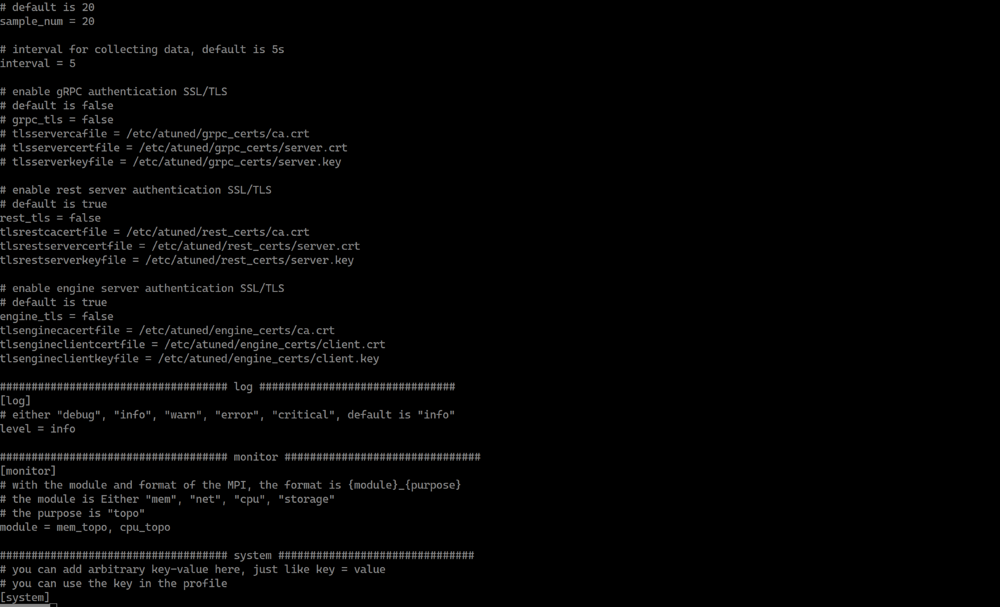
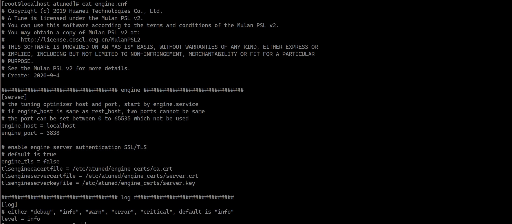
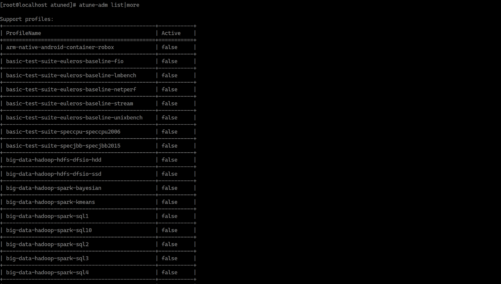
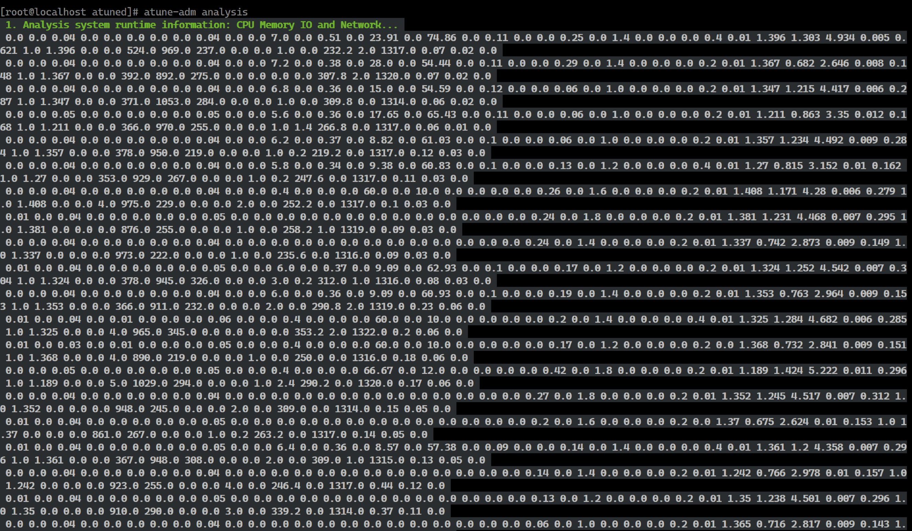

### A-Tune 介绍

A-Tune 是 openEuler 系统推出的一款性能自优化软件. 众所周知, 操作系统和应用软件的配置参数浩如烟海, 同时现代软件和业务场景层出不穷, 如何让操作系统和应用软件达到最佳性能一直是程序员的重大挑战之一. 近几年, AI 技术取得了快速的发展, 在各个领域大显身手. 但一款利用人工智能技术优化操作系统和应用软件参数的框架还是一片空白.

A-Tune 利用 AI 技术降低操作系统和应用程序参数的调优难度. 通过系统画像, 自动感知, 算法模型, 为每一款应用, 每一个场景, 找到最适合的参数配置.

A-Tune 实战系列文章, 旨在展示官方用户手册的基础上, 通过步骤分解和大量示例, 记录过程中遇到的各种问题.详细讲解 A-Tune 的功能.

### 1. 安装

- 硬件: 鲲鹏 920
- 操作系统: openEuler

A-Tune 是一款专门针对鲲鹏 920 服务器和 openEuler 操作系统的性能优化软件.

A-Tune 支持单机和分布式两种安装方式. 本文尝试的是单机部署方式, client 和 server 端安装在相同的机器上.

A-Tune 的软件包已经集成在 openEuler 公布的软件源中, 可以方便的通过 yum 进行安装.

##### 1.1 安装 atune client 和 db

```
# yum install atune
```

这个过程安装的包分为以下几类:

- atune client 端
- atune db
- 操作系统参数采集: hwloc, perf, sysstat, prefetch_tuning, lm_sensors
- Web 微框架: python3_flask 等
- 科学计算: python3_numpy, python3_pandas


##### 1.2 安装 atune-engine

```
# yum install atune-engine
```

atune-engine 依赖的包基本都是 AI 的科学计算库和算法库


##### 1.3 确认安装结果成功


### 2. 配置文件

A-Tune 的配置文件位于`/etc/atuned/` 路径下


两个最重要的配置文件 `atuned.cnf` 和 `engine.cnf`

##### 2.1 查看配置文件 `atuned.cnf`

```
cat /etc/atuned/atuned.cnf
```






##### 2.2 修改参数 ` network`

可以通过`ifconfig`命令查询网卡名称


设置到`atuned.cnf`中

```
# the network to be analysis
network = enp125s0f0
```

##### 2.3 查看配置文件 `engine.cnf`

```
cat /etc/atuned/atuned.cnf
```



### 3. 部署和启动

##### 3.1 用 `systemctl` 启动 A-Tune 服务

```
# systemctl start atuned
# systemctl status atuned
```


其中黄色字体的 log 是一段 warning , 这是因为 A-Tune 服务启动时, 没有进行 workload type 检测, 因此没有激活任何 profile, 通过`atune-adm list` 命令也能看出来当前所有的 profile 状态都为 false

##### 3.2 显示当前支持的 workload type

```
# atune-adm list
```



##### 3.3 分析系统性能和自动激活相应的 profile

```
# atune-adm analysis
```




经过 analysis 过程, 利用工具( perf , sysstat 等)采集操作系统的参数, 将采集到的参数输入给训练好的模型, 识别出当前系统 workload 为 default 类型, 最后将 default workload type 对应的 profile 设置到系统中.

### 4. 小结

本文实践了 A-Tune 的安装, 部署和启动过程, 分步骤分过程详细解释了其中的具体细节. 通过本文, 可以简单快速的熟悉 A-Tune 软件. 下一步我们将详解 A-Tune 的其它功能.
